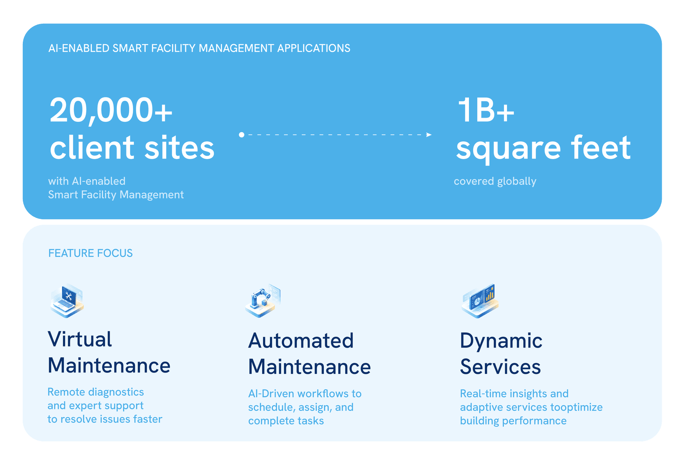
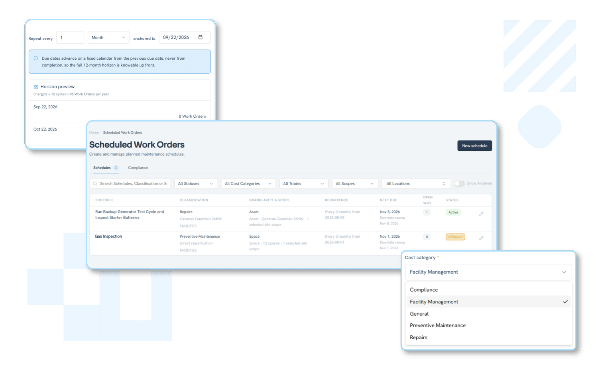

La IA agéntica nació en la sala de servidores. Ahora se está extendiendo a la forma en que realmente se gestionan los edificios.

La última vez le contamos que el edificio estaba vivo. Los edificios empezaban a pensar por sí mismos, los robots asumían los trabajos que nadie quería y el mantenimiento predictivo sustituía discretamente la costumbre, mucho más cara, de esperar a que las cosas se estropearan. Tres cambios, una tesis: la inteligencia es real, pero alguien tiene que seguir gestionando el edificio que hay debajo.

Ahora el edificio se ha vuelto ambicioso. Este artículo trata del cuarto cambio y del ciclo operativo que debe existir debajo para que todo funcione de verdad: **señal, decisión, trabajo asignado, finalización verificada, visión de la cartera.**

[Lea el análisis anterior](/es/insights/the-building-is-alive)

---

## De la sugerencia a la acción

Hay una distinción que recorre todas las conversaciones sobre tecnología inmobiliaria en 2026: la diferencia entre una IA que le dice algo y una IA que hace algo. Los tres primeros cambios trataban sobre todo de lo primero: sensores más precisos, mejores predicciones, un panel que muestra una anomalía y espera a que alguien actúe.

La IA agéntica cierra ese ciclo. En lugar de señalar un problema y quedarse ahí, puede asignar el trabajo, activar el siguiente paso y actualizar el registro, acortando la distancia entre una señal y una tarea real.**Gartner prevé que el 33 % de las aplicaciones de software empresarial incluirán IA agéntica en 2028**. Gartner también prevé que, ese mismo año, al menos el 15 % de las decisiones laborales cotidianas se tomarán de forma autónoma mediante IA agéntica.

_Infografía que muestra la gestión inteligente de instalaciones con IA de CBRE implantada en más de 20 000 sedes de clientes y más de 1000 millones de pies cuadrados en todo el mundo, con tres funciones destacadas: mantenimiento virtual, mantenimiento automatizado y servicios dinámicos._

Fuente: CBRE

En la gestión de instalaciones, la categoría ya está tomando forma. CBRE afirma que sus soluciones de gestión inteligente de instalaciones con IA están implantadas y ha publicado casos que describen mantenimiento virtual, mantenimiento automatizado y servicios dinámicos (cifras comunicadas por CBRE). Los proveedores también están lanzando productos agénticos con nombre propio: Facilio anunció su conjunto de agentes "Atom" en febrero de 2026, y Fexa anunció "FexaAI" en abril de 2026.

---

## La brecha entre probar y ganar

Esto es lo que suelen omitir las conferencias: una encuesta de 2025 a más de 1500 responsables de decisiones del sector inmobiliario reveló que el 88 % de las empresas ya están probando la IA. **Solo el 5 % afirma haber alcanzado sus objetivos con ella.** Más del 60 % describe su propia organización como no preparada, estratégica, organizativa o técnicamente, para lo que ya ha implantado.

### La adopción de la IA en el sector inmobiliario va por delante de los resultados (2025)

_El 88 % de las empresas inmobiliarias está probando la IA. Solo el 5 % afirma haber alcanzado realmente sus objetivos con ella._

_Fuente: JLL 2025 Global Real Estate Technology Survey: Buildium 2026 State of Property Management_

Se le puede dar a un agente la autoridad para enviar a un técnico. Pero si las órdenes de trabajo están repartidas en tres sistemas desconectados y el historial de los activos está en una hoja de cálculo que nadie ha tocado desde la primavera, el agente no tiene nada fiable sobre lo que actuar. La brecha tiene menos que ver con la falta de inteligencia y mucho más con la falta de un lugar real donde esa inteligencia pueda trabajar.

[Vea los flujos de trabajo personalizados](/es/custom-workflows)

---

## Aquí es donde entra **Fleet**

Conviene ser concretos en esta parte, porque "columna vertebral operativa" puede sonar a eslogan hasta que se ve lo que realmente sustituye.

Cuando se detecta una incidencia, ya sea por un técnico que recorre la cubierta, un sensor en la sala de máquinas o un agente de IA que analiza un flujo de datos, Fleet la convierte en una tarea con un responsable y un plazo. Todos los inmuebles de la cartera aparecen en un único panel con mapa, así que averiguar en qué sede ocurrió algo deja de consumir media mañana. Cada reparación se registra en el historial completo del activo, de modo que, seis meses después, nadie tiene que reconstruir de memoria si ese equipo de HVAC ya había fallado antes. Todo se consolida en una única vista de informes que muestra lo que está vencido, en curso o terminado en todas las sedes, actualizada en tiempo real en lugar de montada a mano al final de la semana.

_Así es en la práctica "un lugar donde aterrizar": las órdenes de trabajo programadas de Fleet convierten el mantenimiento recurrente en un calendario fijo, para que el trabajo preventivo se haga a tiempo en lugar de depender de que alguien se acuerde._

La automatización de flujos de trabajo de Fleet está diseñada precisamente para este traspaso: asignar una incidencia detectada al técnico adecuado, activar la lista de control correcta y llevarla hasta el cierre sin que nadie tenga que guiarla manualmente por cuatro herramientas distintas. Un agente de IA puede ser más inteligente cada año. Pero aquello a lo que entrega su resultado tiene que responder todos los días.

[Más información](/es/features-overview)

---

## Mirando al futuro

Los edificios son cada vez más capaces y, evidentemente, más autónomos. Las propias cifras del sector indican que la mayoría de los equipos aún no ha construido la base que esa autonomía necesita para dar frutos, lo que deja mucho margen a quien la construya primero.

El edificio puede ser tan ambicioso como prometen los proveedores. La tarea de Fleet es asegurarse de que tenga un lugar real donde poner esa ambición a trabajar.

Descubra cómo Fleet ofrece a su equipo, y a su IA, un lugar real desde el que gestionar el edificio: pruebe nuestra demo gratuita en staging.runfleet.com/demo o siga leyendo nuestros últimos análisis.

_Fuente: encuesta de JLL de 2025, previsión de Frost and Sullivan, comunicado del 23 de junio de 2026, Departamento de Energía de EE. UU._

---

## Vea **Fleet** en acción

_Gestione el mantenimiento, el cumplimiento normativo, los activos y las operaciones diarias desde una sola plataforma._

[Pruebe nuestra demo hoy](https://staging.runfleet.com/demo)
