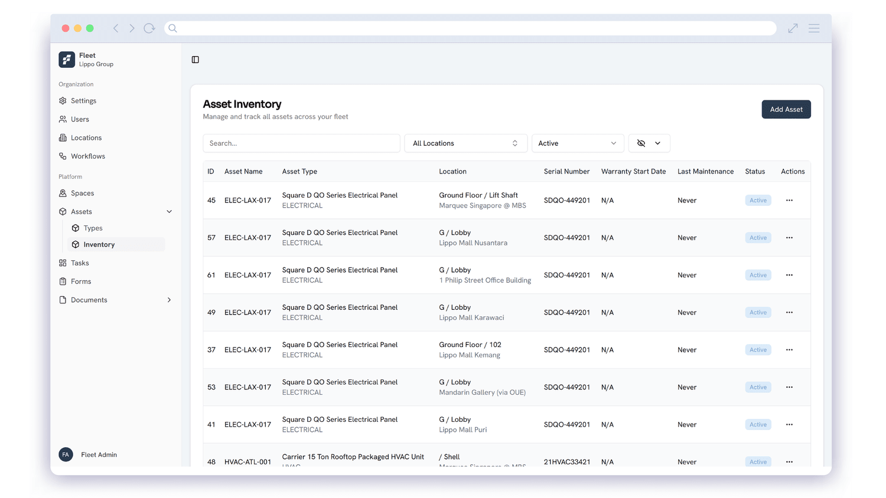
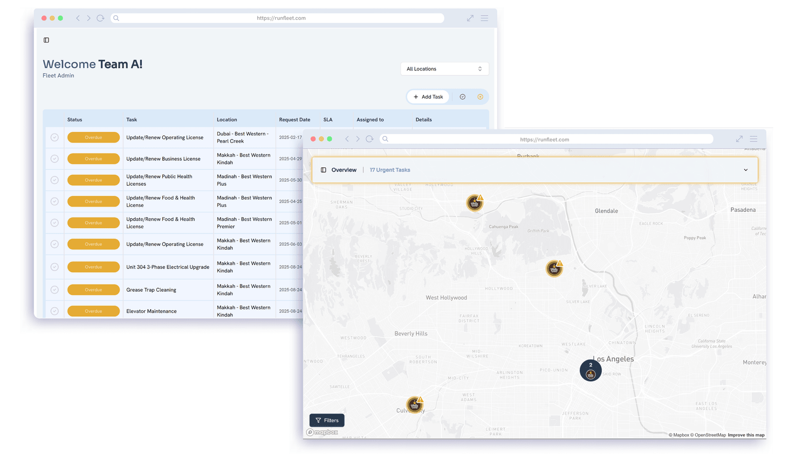
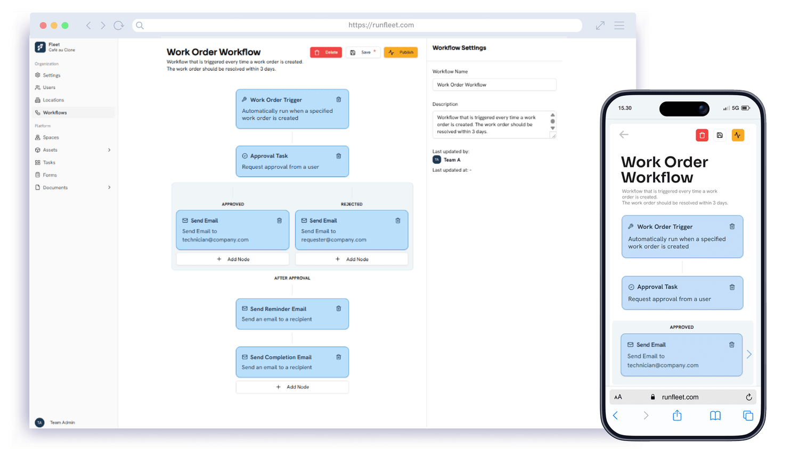
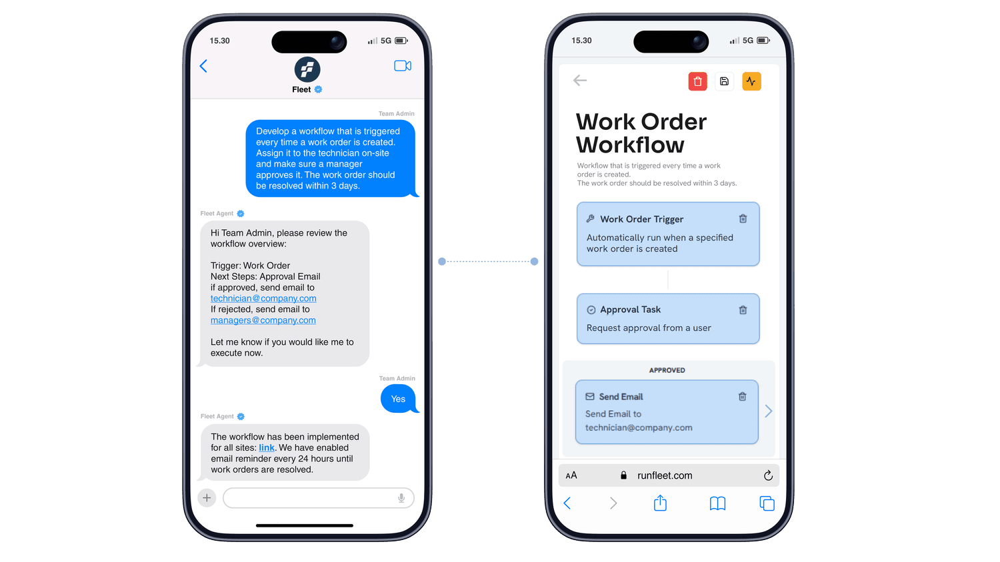

Afluencia de público en un centro comercial moderno, que pone de relieve la complejidad operativa a la que se enfrentan los propietarios y la creciente necesidad de una gestión de instalaciones y activos impulsada por IA.

En una época de expectativas crecientes de los compradores y márgenes más ajustados, los propietarios de inmuebles comerciales deben evolucionar más rápido que nunca. Los grandes centros y complejos comerciales afrontan presiones cada vez mayores: desde los cambios en la afluencia y los costes energéticos hasta la **complejidad operativa** y los **riesgos del ciclo de vida de los activos**. Ahí es donde el PropTech y la IA ofrecen una ventaja decisiva.

---

## El panorama operativo: más grande, más rápido, más inteligente

#### Impacto y percepción de la IA en las instalaciones y el mantenimiento

## **30 %** de reducción del tiempo de inactividad

## **22 %** de reducción de costes

## **Más del 70 %** considera la IA esencial para la gestión de activos

_(Fuente: FMC, Zipdo)_

Según estudios recientes, los sistemas de gestión de instalaciones con IA superan a las operaciones convencionales entre un 20 y un 30 % en indicadores clave como el tiempo de inactividad y el control de costes. Al mismo tiempo, la adopción del PropTech en los inmuebles comerciales responde a una necesidad: **la visibilidad en tiempo real, las operaciones centralizadas y los flujos de trabajo inteligentes** son hoy el núcleo de la gestión moderna de centros comerciales, y más del 70 % de los profesionales del sector de las instalaciones cree que **la IA es esencial para la gestión de activos.**

Por ejemplo, el sector inmobiliario comercial ha registrado una recuperación gradual del valor y la ocupación de los centros comerciales en muchos mercados. Aun así, los ganadores serán quienes gestionen sus operaciones de forma proactiva.

_(Fuente:_ [_FMJ_](https://www.fmj.co.uk/unlocking-ai-in-facilities-management-key-to-efficiency-cost-savings-and-competitive-advantage/)_,_ [_Emerald_](https://www.emerald.com/pm/article/doi/10.1108/PM-02-2025-0007/1276856/Adoption-of-artificial-intelligence-in-property)_,_ [_sescom.eu_](https://sescom.eu/en/blog/2025/02/04/proptech-the-future-of-facility-management/)_,_ [_cbreim.com_](https://www.cbreim.com/insights/articles/retail-revival-a-targeted-turnaround-for-shopping-centers)_)_

---

## Por qué las operaciones de un centro comercial necesitan una plataforma unificada

Técnicos realizando mantenimiento preventivo de HVAC e instalaciones MEP, lo que muestra cómo plataformas GMAO inteligentes como Fleet reducen el tiempo de inactividad y estandarizan las operaciones de las instalaciones.

Gestionar varias plantas, inquilinos, proveedores de servicios, activos, sistemas de HVAC, escaleras mecánicas y aparcamientos es complejo. Cada elemento queda aislado: **registros de mantenimiento, solicitudes de servicio de los inquilinos, ciclos de vida de los activos, planes de limpieza**. Sin un sistema unificado, los costes aumentan, las paradas se alargan y la satisfacción de los inquilinos cae.

Fleet ofrece a los operadores de centros comerciales y retail visibilidad en tiempo real de cada sede. Conecta activos, equipos y proveedores en un ecosistema operativo unificado y fluido. Eso significa coordinar equipos y proveedores en tiempo real, estandarizar las operaciones a escala, reducir el tiempo de inactividad y aumentar la disponibilidad.

[Descubra cómo unificamos su ecosistema operativo](/es/facility-management)

---

## Funciones concretas, impacto tangible

Así resuelve Fleet los problemas reales de los administradores de centros comerciales e inmuebles de retail:

El panel de inventario de activos de Fleet consolida los datos de los activos, el historial de su ciclo de vida y los registros de mantenimiento para ayudar a los operadores de centros comerciales y retail a gestionar sus equipos de forma proactiva.

### Seguimiento de órdenes de trabajo y activos

Fleet centraliza todos los activos de los que depende su operación comercial: desde escaleras mecánicas y equipos de HVAC hasta centrales de incendios y equipamiento de trastienda. Cada activo incluye su historial completo, lo que da a los equipos visibilidad en tiempo real del rendimiento, las reparaciones anteriores y el próximo mantenimiento preventivo. Fleet genera automáticamente tareas de mantenimiento preventivo planificado (PPM) cuando los datos o las señales de uso indican desgaste, para que sus equipos cumplan la normativa y las paradas se mantengan al mínimo. Esto aporta coherencia a las carteras multisede y permite a los responsables gestionar el mantenimiento de forma proactiva en lugar de reaccionar ante las averías.

_El panel de operaciones en tiempo real de Fleet ofrece visibilidad multisede con ubicaciones en el mapa, tareas abiertas e indicadores de rendimiento para tomar decisiones basadas en datos._

### Paneles en tiempo real

Los paneles en tiempo real de Fleet reúnen el estado operativo de cada sede en una vista unificada. La tabla de estado de las instalaciones señala las incidencias urgentes por ubicación para que los responsables sepan exactamente dónde actuar primero. Los resúmenes visuales, como los gráficos de tareas abiertas frente a cerradas y los indicadores de tiempo medio de resolución, convierten la actividad diaria en información clara y útil. Así, los equipos de operaciones detectan cuellos de botella, comparan el rendimiento entre centros o tiendas y mantienen el cumplimiento con total confianza. Con Fleet, los responsables obtienen visibilidad al instante, sin rebuscar en hojas de cálculo ni en herramientas fragmentadas.

Cree, asigne y haga seguimiento de órdenes de trabajo desde el ordenador y el móvil. Fleet agiliza los flujos de mantenimiento multisede para técnicos y equipos inmobiliarios.

### Formularios y flujos de trabajo inteligentes

Desde las revisiones de higiene del patio de comidas hasta las inspecciones de ascensores y las auditorías de limpieza del aparcamiento, Fleet le permite crear formularios inteligentes y personalizables para cada sede. Estos formularios impulsan flujos de trabajo automatizados: si un técnico selecciona “fallo del sensor de puerta”, Fleet genera al instante una orden de trabajo, avisa al proveedor asignado y registra la incidencia para los informes. Cada formulario se convierte en el punto de partida de operaciones estandarizadas y predecibles. Esto reduce el seguimiento manual, refuerza el cumplimiento y garantiza que todas las sedes sigan los mismos estándares de calidad y seguridad.

El agente de IA de Fleet permite crear órdenes de trabajo a través del chat, automatizando flujos y acelerando las operaciones inmobiliarias con una gestión inteligente de las tareas.

### Preparado para el PropTech y la IA

Fleet está diseñado para el futuro de las operaciones inmobiliarias. Su lógica asistida por IA permite el mantenimiento predictivo, una clasificación de tareas más inteligente y un procesamiento de datos más rápido, y convierte las operaciones inmobiliarias en un ecosistema conectado e inteligente. Al eliminar los silos de datos y estandarizar los flujos de trabajo a escala, Fleet prepara a los centros comerciales y las carteras de retail para operar con mayor eficiencia, más resiliencia y un mayor ROI a largo plazo.

---

## Por qué el momento es ahora

Con el capital riesgo para PropTech todavía en circulación (2200 millones de US$ en operaciones a nivel mundial) y un cambio en marcha en el sector de una gestión de instalaciones reactiva a otra proactiva, los operadores de centros comerciales no pueden esperar con sistemas heredados. Según las tendencias del mercado, la gestión inteligente de activos se reconoce cada vez más como una pieza clave de la eficiencia operativa y la sostenibilidad. Por ejemplo, un análisis reciente reveló que las organizaciones consideran que las tecnologías emergentes mejoran la eficacia de la gestión de activos en un **46 %**.

Fleet sustituye las hojas de cálculo, las aplicaciones de servicio independientes y los proveedores aislados por un único flujo de trabajo en la nube. Mantiene cada inmueble al día, cada equipo alineado y cada activo optimizado.

_(Fuente:_ [_EY_](https://www.ey.com/content/dam/ey-unified-site/ey-com/en-cn/newsroom/2022/9/documents/ey-uli-gba-prop-tech-white-paper-en.pdf?utm_source=chatgpt.com)_,_[_Facilities and Estates Management Live_](https://facilities-estates.co.uk/facilities-management-trends-2025/?utm_source=chatgpt.com)_,_ [_jll.com_](https://www.jll.com/en-sea/insights/ai-and-the-evolution-of-proptech?utm_source=chatgpt.com)_)_

---

## Conclusión

Para los operadores de centros comerciales e inmuebles de retail, el futuro está claro: visibilidad, control y eficiencia en cada sede.

Con Fleet, coordina sus equipos, automatiza sus tareas de mantenimiento, supervisa el estado de sus activos y gestiona su cartera con confianza.

De la limpieza a la inspección de escaleras mecánicas, de los servicios a inquilinos a la optimización del consumo energético, Fleet hace que las operaciones sean fluidas, escalables y modernas.

[Programe hoy su demo interactiva](/es/contact)
