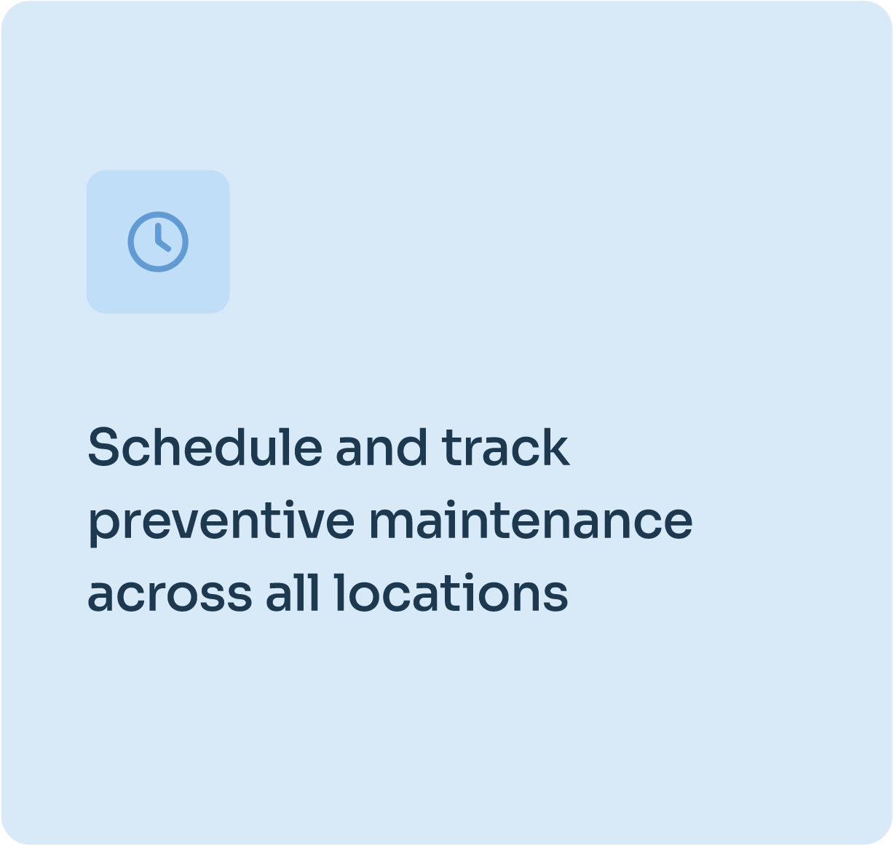
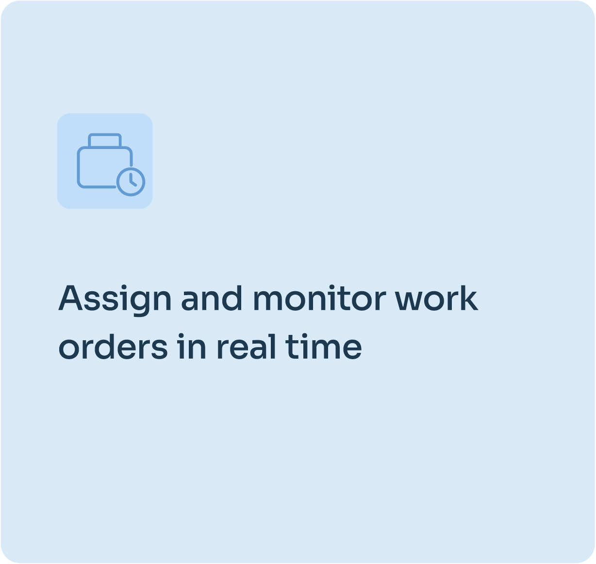
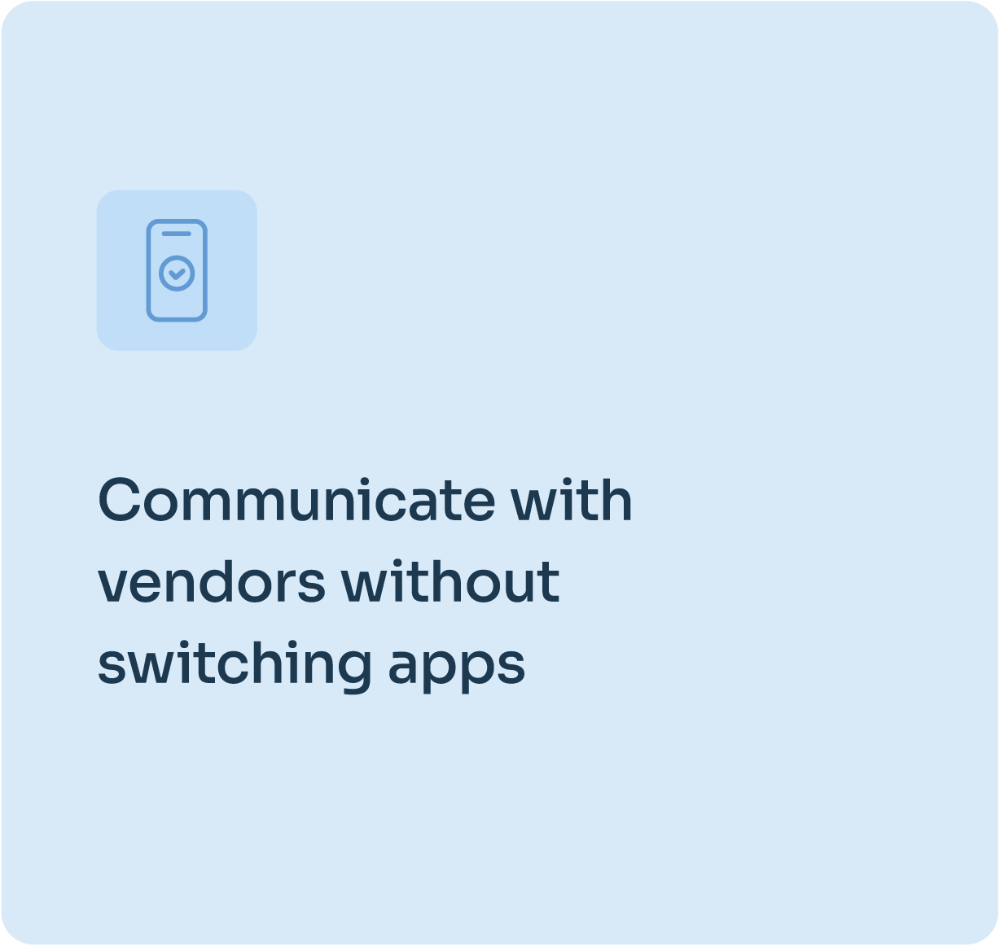
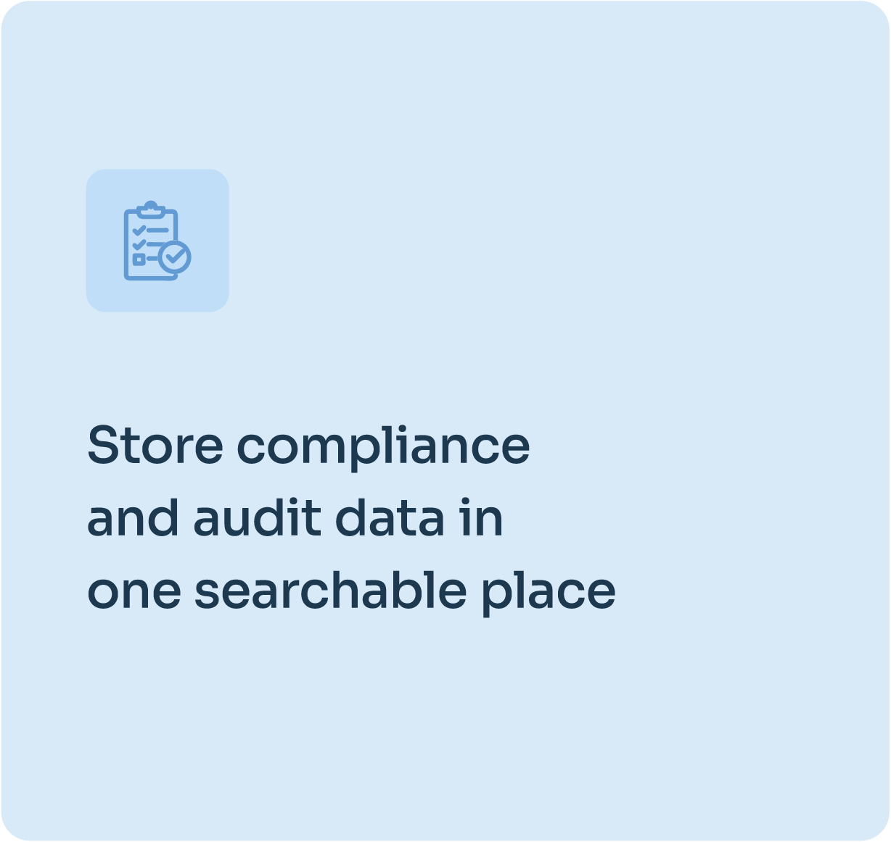

Dans l’exploitation immobilière, chaque retard, chaque intervention oubliée et chaque processus inefficace coûte de l’argent.

Que vous gériez un seul bien ou un patrimoine national, s’appuyer sur des méthodes de maintenance dépassées, ou n’avoir aucun système structuré, **peut faire grimper discrètement vos charges d’exploitation (OPEX) et ralentir votre équipe**.

---

## Le véritable coût de la maintenance traditionnelle

De nombreuses équipes immobilières gèrent encore la maintenance avec des tableurs, des conversations WhatsApp ou des outils de GMAO dépassés. Ils semblent « bon marché » au départ, mais **les coûts réels s’accumulent vite** :

**Interventions oubliées :** réparations retardées, locataires mécontents et atteinte à la réputation

**Coordination lente des prestataires** : immobilisations prolongées et pertes de revenus

**Risques de non-conformité** : des registres incomplets pouvant entraîner des amendes ou des poursuites

**Interventions curatives** : des réparations inutiles qu’une maintenance préventive aurait permis d’éviter

Certains se replient sur un gestionnaire immobilier externe, mais ce confort a un prix élevé.

---

## Gestion en direct ou gestionnaire externe

Faire appel à une société de gestion immobilière peut sembler la solution de facilité, mais la plupart facturent 6 à 8 % du chiffre d’affaires total. À l’échelle d’un patrimoine, cela peut **doubler vos OPEX**, en particulier pour les biens à fort rendement.

Avec Fleet, **la gestion en direct n’est pas seulement possible. Elle est plus efficace** :

- **Une maîtrise opérationnelle totale** sans perdre vos relations prestataires
- **Des registres centralisés** pour plus de transparence et de responsabilité
- **Des coûts réduits** sans sacrifier la qualité de service
- **Des systèmes évolutifs** qui grandissent avec votre patrimoine

---

## Fleet : le centre de commande de votre exploitation immobilière

Fleet n’est pas une GMAO générique. Il est conçu spécifiquement pour les **patrimoines immobiliers multisites**, afin de réduire les OPEX, de fluidifier les processus et de vous offrir une visibilité sur l’ensemble du patrimoine.

Depuis un tableau de bord unique, votre équipe peut :

Pas de fonctionnalités industrielles superflues. Pas de tableurs éparpillés ni de chaînes d’e-mails. Seulement les outils dont les équipes immobilières et de facility management ont réellement besoin.

---

## Une plateforme. Une maîtrise totale du patrimoine.

Fleet réunit les données de maintenance, financières et d’actifs au même endroit, pour que vous puissiez :

- Relier les bons de travail aux centres de coûts et aux systèmes de comptabilité fournisseurs et clients
- Suivre l’amortissement des actifs et établir des budgets précis
- Générer en quelques secondes des rapports prêts pour l’audit
- Tout consulter sur mobile, ordinateur ou tablette, sans installation

---

## Reprenez la maîtrise de vos OPEX

Fleet vous aide à travailler plus intelligemment : moins de retards, moins d’e-mails, des coûts réduits, et la capacité de grandir sans ajouter de complexité.

---

## Essayez Fleet avec votre propre patrimoine, sans risque

Nous ne nous contentons pas de vous expliquer comment fonctionne Fleet : nous vous le montrons. Organisez un essai gratuit et sans engagement, pour lequel nous configurerons vos biens dans notre environnement de test. Vous verrez exactement comment Fleet fonctionne pour vos biens, vos équipes et vos processus.

### [**Planifiez votre démo interactive dès aujourd’hui**](/fr/contact) et faites le premier pas vers une exploitation plus rapide et des OPEX réduits.

Vous voulez voir comment Fleet résout ce problème pour votre équipe ? Découvrez notre [fonctionnalité de gestion des installations](/fr/facility-management) ou voyez comment [Fleet accompagne les opérations logistiques](/fr/shipping-logistics)
