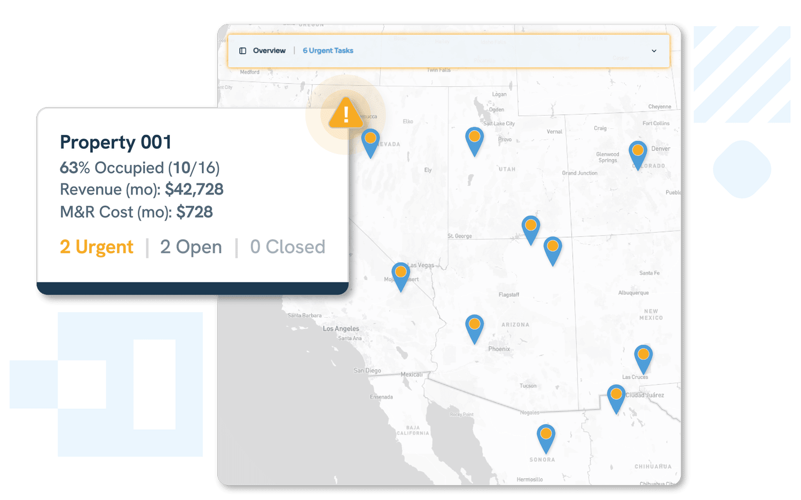
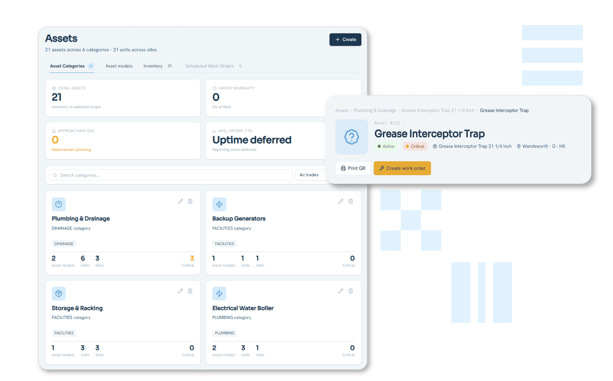
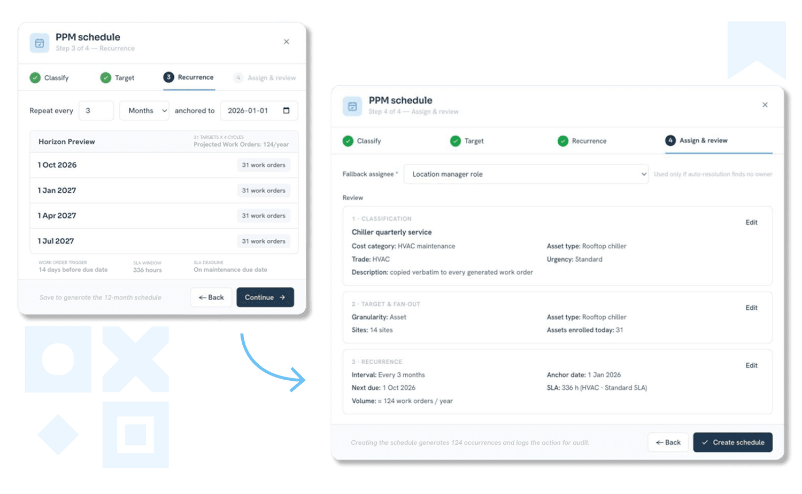

## Votre logiciel n’a pas été prévenu.

L’IA est peut-être dans le bâtiment, mais il faut toujours quelqu’un pour s’assurer que le travail est fait. Le bon logiciel relie les signaux intelligents à des actions concrètes.

Dans l’immobilier, l’IA vivait autrefois entièrement sur un écran : tableaux de bord, alertes, jolis graphiques sur lesquels quelqu’un devait encore agir à la main. Cette époque est révolue. L’IA est sortie de l’onglet du navigateur pour s’installer dans le bâtiment lui-même : les thermostats, les centrales d’accès, les chariots de maintenance, les check-lists d’inspection qui assurent le bon fonctionnement de tout. C’est désormais dans le monde physique que tout se joue, et cela change ce que les équipes de facility management attendent réellement de leur logiciel.

Voici pourquoi c’est important : les bâtiments consomment environ 30 % de l’énergie mondiale et représentent près de 40 % des émissions de CO2 liées à l’énergie. Ici, les petits gains opérationnels représentent de vraies sommes et de vrais risques, à grande échelle. Les analystes voient en 2026 l’année où l’IA cesse de simplement pointer les problèmes pour prendre les commandes. La question n’est pas de savoir _si_ l’IA touchera vos bâtiments, mais si vos systèmes sauront suivre.

Trois évolutions sont à l’œuvre, et toutes trois mènent à la même conclusion : les bâtiments ont besoin d’un véritable socle opérationnel sous l’intelligence. C’est ce manque que Fleet comble.

---

## Évolution 1 : **Le bâtiment est vivant** 🧟‍♀️

### Les bâtiments apprennent à fonctionner seuls, ou presque.

Température, éclairage, sûreté, énergie : tout commence à penser par soi-même, en réagissant en temps réel à l’occupation, à la météo, voire au prix de l’électricité, au lieu de suivre un programme réglé en mars dernier. L’IA moderne peut ajuster le CVC à la volée et coordonner l’effacement de consommation sur tout un patrimoine à la fois.

Très bien. Sauf que la plupart des bâtiments ne sont pas équipés pour. CVC, éclairage, sûreté et énergie relèvent généralement d’outils distincts, de fournisseurs distincts, qui parlent des langages distincts, et personne n’a de vue d’ensemble. Une IA n’est jamais plus intelligente que la tuyauterie qui la porte, et aujourd’hui cette tuyauterie est un véritable casse-tête pour la plupart des équipes.

# **~30 %**

### D’économies moyennes sur le CVC

# **10-30 %**

### De consommation d’énergie en moins

Le potentiel est pourtant bien réel : le Département de l’Énergie des États-Unis estime que les systèmes de régulation performants permettent en moyenne ~30 % d’économies sur le CVC, et que la modernisation des régulations et des logiciels réduit de 10 à 30 % la consommation d’énergie des bâtiments existants. Ce n’est pas une promesse lointaine : c’est un enjeu de coûts, de résilience et de conformité, ici et maintenant.

Lorsque l’exploitation s’étend sur plusieurs sites, la visibilité est le premier pas vers la maîtrise. Fleet offre aux équipes immobilières une vue cartographique des biens, des tâches et de l’activité opérationnelle au même endroit.

C’est là qu’intervient Fleet. Il faut toujours quelqu’un pour transformer « l’IA a détecté quelque chose de bizarre » en tâche attribuée, en réparation terminée et en traçabilité, sur chaque site, chaque prestataire et chaque système. Fleet vous offre un endroit unique pour gérer les bons de travail, suivre l’historique complet des actifs et centraliser chaque inspection et chaque piste d’audit, de la première alerte au ticket clôturé.

---

## Évolution 2 : **La vie des robots ne compte pas**

### Le travail le plus sûr est celui qu’aucun humain n’a à faire.

Les robots prennent en charge les tâches dont personne ne voulait de toute façon. Selon le NIOSH, les entreprises américaines s’appuient de plus en plus sur des robots pour les travaux dangereux et répétitifs, parce que c’est plus sûr, du moins pour les humains.

Le danger a souvent l’air banal : une inspection de toiture par mauvais temps, une salle des machines étouffante, un espace confiné, une manutention répétitive, un contrôle d’équipement sans aucun réseau. L’automatisation retire les personnes de la partie la plus risquée et la plus évitable du travail.

Mais les robots ne sont pas des baguettes magiques de la sécurité. Le NIOSH est clair : les systèmes robotisés comportent leurs propres risques, comme l’écrasement, le coincement ou le happement par un élément qu’on n’a pas vu venir. La formation, les protections et la supervision restent essentielles. Des bâtiments plus sûrs naissent de l’alliance entre des machines plus intelligentes et un management plus rigoureux, pas du remplacement de l’un par l’autre.

Les équipes immobilières ont toujours besoin de l’historique des actifs, des registres de maintenance et du contexte pour décider de la suite. Fleet garde les informations de chaque actif organisées et accessibles.

C’est là qu’un bon logiciel fait ses preuves. Fleet aide les équipes à créer des check-lists d’inspection et des processus de sécurité, à consigner les incidents avec un vrai suivi, et à voir précisément qui a fait quoi, où et quand, de façon standardisée dans chaque bâtiment, avec chaque prestataire et sur chaque site.

---

## Évolution 3 : **L’hospitalité sans limites**

### Réparer avant la panne est devenu la norme.

Une hospitalité d’excellence consiste à résoudre le problème avant même que le client en ait conscience. Les bâtiments rattrapent ce standard. La maintenance proactive est désormais la norme. L’IA peut détecter un équipement défaillant des semaines avant qu’il ne lâche, et c’est essentiel, car la maintenance curative est l’une des habitudes les plus coûteuses de l’immobilier : arrêts, locataires mécontents, appels paniqués aux prestataires, érosion silencieuse de la valeur des actifs.

L’Institut Veolia en apporte la preuve : des déploiements réels où des bâtiments dotés d’IA ont révélé des inefficacités cachées et généré d’importantes économies d’énergie, simplement en observant mieux et en planifiant mieux la maintenance.

Mais il y a un hic : une prédiction ne vaut rien si rien ne se passe ensuite. Un risque signalé qui dort dans une boîte de réception n’est pas une information utile. Il doit devenir une tâche, un responsable, un enregistrement, une boucle bouclée, et vite.

La maintenance préventive est plus efficace lorsqu’elle débouche sur l’action. Fleet aide les équipes à planifier les interventions, à orienter les bons de travail et à anticiper les problèmes d’actifs avant qu’ils ne deviennent des perturbations.

Fleet est cette boucle bouclée. Planification préventive, orientation automatique des bons de travail, mises à jour mobiles depuis le terrain, historique complet par actif, visibilité totale sur ce qui est en retard, en cours ou terminé. Fleet transforme une prédiction en travail accompli, au lieu d’une alerte de plus que personne n’a le temps de traiter.

[Découvrir les agents IA de Fleet](/fr/ai-agents)

---

## **Vue d’ensemble**

Frost & Sullivan qualifie 2026 d’année charnière pour les bâtiments intelligents pilotés par l’IA agentique. Mais une chose ne change pas : aussi intelligente que devienne l’IA, il faut toujours quelqu’un pour faire tourner le bâtiment. Les équipes immobilières ont besoin d’une couche opérationnelle fiable sous tout cela.

L’IA peut signaler l’anomalie. Il faut toujours une vraie plateforme pour transformer cette intelligence en travail accompli, sur chaque site de votre patrimoine.

Fleet offre aux équipes immobilières et de facility management la visibilité, la structure et la responsabilisation nécessaires pour mieux exploiter leurs bâtiments dans un monde façonné par l’IA.

_Source : enquête JLL 2025, prévisions Frost and Sullivan, communiqué du 23 juin 2026, Département de l’Énergie des États-Unis_

---

## **Prêt à le voir en action ?**

_Essayez la démo gratuite de Fleet et gérez la maintenance, la conformité, les actifs et l’exploitation quotidienne depuis une seule plateforme :_

[Essayez notre démo dès aujourd’hui](https://staging.runfleet.com/demo)
