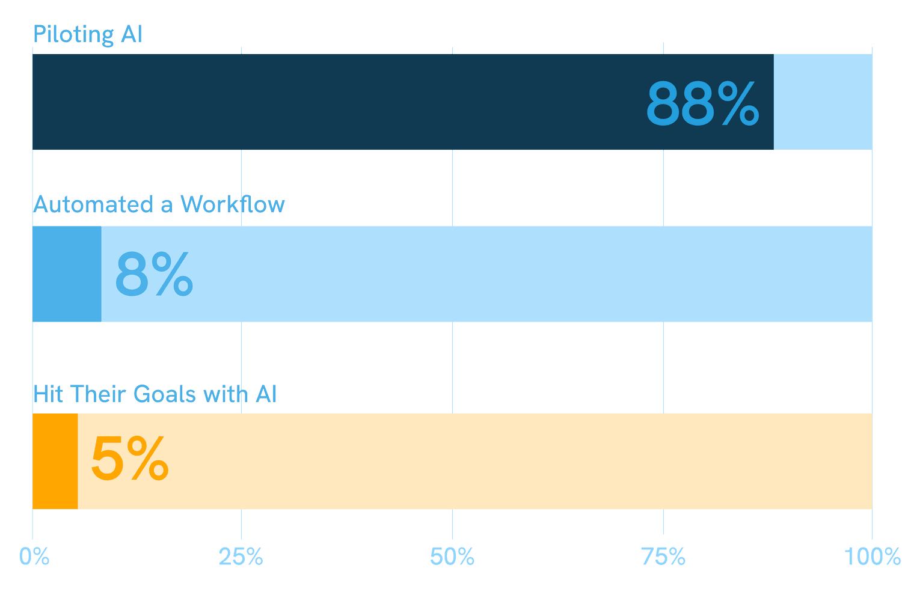

智能体 AI 起步于服务器机房，如今正逐步延伸到楼宇的实际管理之中。

上一次，我们告诉您：楼宇是“活”的。楼宇开始自主思考，机器人承担起无人愿做的工作，预测性维护正悄然取代“坏了再修”这种代价高昂得多的习惯。三大转变，一个核心观点：智能是真实存在的，但在它之下，仍然需要有人来运营楼宇。

如今，楼宇变得更有“野心”了。本文将探讨第四大转变，以及要让这一切真正奏效、其底层必须具备的运营闭环：**信号、决策、派发工作、验证完成、资产组合洞察。**

[阅读上一篇洞察](/zh/insights/the-building-is-alive)

---

## 从建议到行动

2026 年，每一场房地产科技讨论中都在浮现一个区别：告诉您某件事的 AI，与真正去做某件事的 AI。前三大转变主要属于前者：更灵敏的传感器、更准确的预测，以及一个发现异常后便等着有人采取行动的仪表板。

智能体 AI 则打通了这个闭环。它不再只是标记问题然后止步，而是能够派发工作、触发下一步并更新记录，缩短信号与实际任务之间的距离。**Gartner 预测，到 2028 年，33% 的企业软件应用将内置智能体 AI**。Gartner 还预测，到同一年，至少 15% 的日常工作决策将通过智能体 AI 自主做出。

_信息图展示了 CBRE 的 AI 智能设施管理已部署于全球 2 万多个客户站点、逾 10 亿平方英尺的空间，并突出三项功能：虚拟维护、自动化维护和动态服务。_

来源：CBRE

在设施管理领域，这一品类已初具雏形。CBRE 表示，其 AI 智能设施管理解决方案已投入部署，并发布了涉及虚拟维护、自动化维护和动态服务的案例资料（数据由 CBRE 提供）。供应商们也在陆续推出有名称的智能体产品：Facilio 于 2026 年 2 月发布了“Atom”智能体套件，Fexa 则于 2026 年 4 月发布了“FexaAI”。

---

## 试点与成功之间的差距

主题演讲往往略过这一点：2025 年一项针对 1,500 多名房地产决策者的调查发现，88% 的企业已在试点 AI，**但只有 5% 表示已借此实现目标。** 超过 60% 的受访者认为，自己的组织在战略、组织或技术层面尚未为已上线的 AI 做好准备。

### 房地产 AI 应用领先于实际成效（2025）

_88% 的房地产企业正在试点 AI，但只有 5% 表示真正实现了目标。_

_来源：JLL 2025 全球房地产科技调查；Buildium 2026 物业管理现状报告_

您可以授权一个智能体去调派技术人员。但如果工单分散在三个互不相通的系统中，资产历史还躺在一份自春天起就无人问津的电子表格里，那么这个智能体就没有任何可靠的依据去行动。这里的差距与智能不足关系不大，关键在于缺少一个能让这些智能真正发挥作用的落脚点。

[查看自定义工作流](/zh/custom-workflows)

---

## **Fleet** 的用武之地

这一部分值得具体说明，因为在您看到“运营中枢”实际取代了什么之前，它听起来可能只像一句口号。

当问题被标记时，无论是技术人员巡视屋顶时发现、机房里的传感器检测到，还是 AI 智能体在解析数据流时识别出，Fleet 都会将其转化为一项有负责人、有截止期限的任务。资产组合中的每一处物业都显示在同一个地图仪表板上，再也不必耗费半个上午去查明问题究竟出在哪个站点。每一次维修都会记录在该资产的完整历史中，因此六个月后，没有人需要凭记忆去回想那台暖通空调机组以前是否出过故障。所有信息都汇总到一个报告视图中，实时显示每个站点哪些工作已逾期、进行中或已完成，而不是在周末手工拼凑。

_这就是“落脚点”在实践中的样子：Fleet 的计划工单将循环维护变成固定日程，让预防性工作按计划进行，而不必等着有人想起来。_

Fleet 自身的工作流自动化正是为这种交接而打造：将被标记的问题派发给合适的技术人员，触发相应的检查清单，并一路推进直至关闭，无需有人手动在四个不同工具之间来回协调。AI 智能体可以年复一年变得更聪明，但承接其输出的系统，必须每一天都经得起考验。

[了解更多](/zh/features-overview)

---

## 展望未来

楼宇正变得越来越强大，显然也越来越自主。但行业自身的数据表明，大多数团队尚未打下让这种自主真正产生回报的基础，这为率先建立这一基础的企业留下了充足的空间。

楼宇可以像供应商承诺的那样雄心勃勃。Fleet 的使命，就是确保这份雄心有一个真正能够落地发挥作用的地方。

了解 Fleet 如何为您的团队和 AI 提供一个真正运营楼宇的平台：欢迎访问 staging.runfleet.com/demo 体验免费演示，或继续阅读我们的最新洞察。

_来源：JLL 2025 年调查、Frost and Sullivan 预测（2026 年 6 月 23 日发布）、美国能源部_

---

## 看看 **Fleet** 的实际表现

_在一个平台上管理维护、合规、资产和日常运营。_

[立即体验演示](https://staging.runfleet.com/demo)
